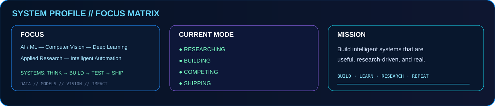
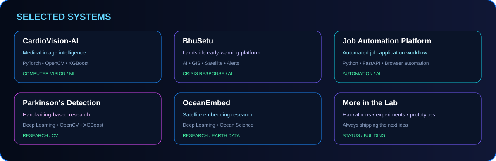

---

## 🧬 NEURAL PROFILE

> **AI / ML engineer focused on computer vision, deep learning, applied research and intelligent automation.**

| FOCUS | CURRENT MODE |
|:---|:---|
| 🧠 Artificial Intelligence / Machine Learning | 🔬 Researching |
| 👁️ Computer Vision | 🛠️ Building |
| 🧬 Deep Learning | 🏆 Competing |
| 📚 Applied Research | 🚀 Shipping |
| ⚙️ Intelligent Automation | 🌐 Open Source |

---

## 🚀 SELECTED SYSTEMS

### 🫀 CardioVision-AI
Medical-image intelligence using deep learning and computer vision.

`PyTorch` `OpenCV` `XGBoost`

**→ [Repository](https://github.com/himani046/CardioVision-AI)**

### 🏔️ BhuSetu
AI-assisted landslide early-warning and crisis-response platform.

`AI` `GIS` `Satellite Data` `Alerts`

**→ [Live Platform](https://bhusetu-3bn4.onrender.com/#/dashboard)**

### 🤖 Job Application Platform
Automation platform for job workflows with profile-aware answers, browser automation and a FastAPI backend.

`Python` `FastAPI` `Browser Automation`

**→ [Repository](https://github.com/himani046/job-application-platform)**

### 🧠 Parkinson's Detection Research
Handwriting-analysis research combining deep learned and handcrafted features.

`PyTorch` `OpenCV` `XGBoost`

### 🌊 OceanEmbed
Satellite-embedding research for reconstruction of subsurface ocean temperature.

`Deep Learning` `Remote Sensing` `Earth Data`

---

## ⚙️ TECHNOLOGY MATRIX

  

`XGBoost` · `LightGBM` · `CatBoost` · `TabNet` · `scikit-learn` · `NumPy` · `Pandas` · `Matplotlib` · `Albumentations`

---

## 🔬 RESEARCH LAB

| COMPUTATIONAL VISION | DEEP LEARNING | APPLIED AI |
|:---:|:---:|:---:|
| Medical Imaging | CNN Architectures | Early Warning |
| Handwriting Analysis | Attention | Job Automation |
| Video Intelligence | Feature Fusion | Fraud Detection |
| Visual Intelligence | Representation Learning | Earth Observation |

---

## 🏆 BUILDING IN PUBLIC

I like taking difficult problem statements and turning them into **working prototypes, experiments and deployable systems**.

**Domains:** `AI` `ML` `Computer Vision` `Cybersecurity` `Geospatial AI` `Automation`

**Community:** AI/ML leadership and technical event work through ACM.

---

## 📡 GITHUB TELEMETRY

  

---

## 🐍 CONTRIBUTION MATRIX

---

### BUILD · LEARN · RESEARCH · REPEAT

**Ideas → Experiments → Systems → Impact**

