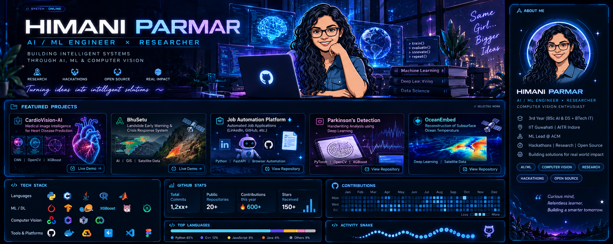
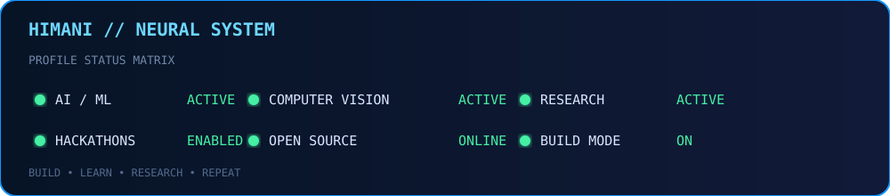
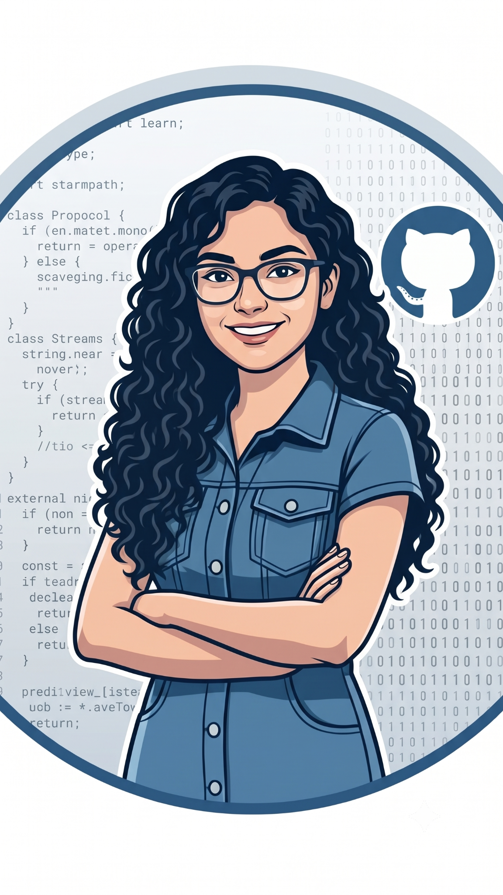

<div align="center">



# `HIMANI PARMAR`

### AI / ML ENGINEER · COMPUTER VISION · RESEARCHER

**Building intelligent systems through AI, machine learning & computer vision.**

[](https://github.com/himani046)
[](https://www.linkedin.com/)
[](mailto:your-email@example.com)

</div>

---

<div align="center">

</div>

## `01 // ABOUT ME`

```text
┌──────────────────────────────────────────────────────────────┐
│  I build practical AI systems and research prototypes.      │
│                                                              │
│  FOCUS                                                       │
│  ├─ Artificial Intelligence / Machine Learning               │
│  ├─ Computer Vision                                          │
│  ├─ Deep Learning                                             │
│  ├─ Applied Research                                          │
│  └─ Intelligent Automation                                    │
│                                                              │
│  CURRENT MODE                                                │
│  ├─ Researching                                              │
│  ├─ Building                                                  │
│  ├─ Competing                                                 │
│  └─ Shipping                                                  │
└──────────────────────────────────────────────────────────────┘
```

<div align="center">

</div>

## `02 // SELECTED SYSTEMS`

<div align="center">

</div>

### 🫀 CardioVision-AI
Medical-image intelligence project focused on cardiovascular analysis using deep learning and computer vision.

**Stack:** `PyTorch` `OpenCV` `XGBoost`

→ [Repository](https://github.com/himani046/CardioVision-AI)

### 🏔️ BhuSetu
AI-assisted landslide early-warning and crisis-response platform combining geospatial information, alerts and decision support.

→ [Live Platform](https://bhusetu-3bn4.onrender.com/#/dashboard)

### 🤖 Job Application Platform
Automation platform for job discovery/application workflows with profile-aware answers, browser automation and a FastAPI backend.

**Stack:** `Python` `FastAPI` `Browser Automation` `GitHub`

→ [Repository](https://github.com/himani046/job-application-platform)

### 🧠 Parkinson's Detection Research
Computer-vision/deep-learning research using handwriting drawings and fused learned + handcrafted features.

**Stack:** `PyTorch` `OpenCV` `XGBoost` `Computer Vision`

### 🌊 OceanEmbed
Research direction for reconstructing subsurface ocean temperature from surface satellite observations using learned satellite embeddings.

**Stack:** `Deep Learning` `Remote Sensing` `Earth Data`

---

## `03 // TECH STACK`

<div align="center">

### Languages


### AI / ML


### Engineering


</div>

**ML:** `XGBoost` · `LightGBM` · `CatBoost` · `TabNet` · `scikit-learn`  
**Data:** `NumPy` · `Pandas` · `Matplotlib`  
**CV:** `OpenCV` · `Albumentations`  
**Cloud / Deployment:** `Render` · `Google Colab` · `Kaggle`

---

## `04 // RESEARCH & EXPERIMENTS`

```text
COMPUTER VISION
    ├── Medical imaging
    ├── Handwriting analysis
    └── Multi-camera video intelligence

DEEP LEARNING
    ├── CNN architectures
    ├── EfficientNet / Inception-style backbones
    ├── Attention mechanisms
    └── Feature-fusion pipelines

APPLIED AI
    ├── Landslide early warning
    ├── Job automation
    ├── Fraud / mule-account detection
    └── Satellite-data intelligence
```

---

## `05 // HACKATHONS & BUILDING`

I enjoy taking ambiguous problem statements and turning them into working prototypes.

**Areas:** `AI` · `ML` · `Computer Vision` · `Cybersecurity` · `Geospatial AI` · `Automation`

**Community:** ML / AI leadership and technical event work through ACM.

---

## `06 // GITHUB TELEMETRY`

<div align="center">

<a href="https://github.com/himani046">
  
</a>
<a href="https://github.com/himani046">
  
</a>

<br/>


</div>

---

## `07 // CONTRIBUTION MATRIX`

<div align="center">


</div>

---

## `08 // CURRENTLY BUILDING`

```text
> booting next-project...
> loading research...
> loading experiments...
> loading caffeine...
> ████████████████████████████████████████ 100%

STATUS: READY TO BUILD.
```

---

<div align="center">

### `BUILD · LEARN · RESEARCH · REPEAT`

**If an idea can be built, let's build it.**

[](https://github.com/himani046)

</div>
